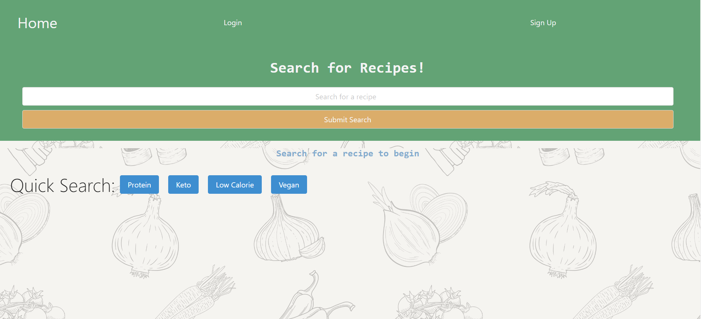
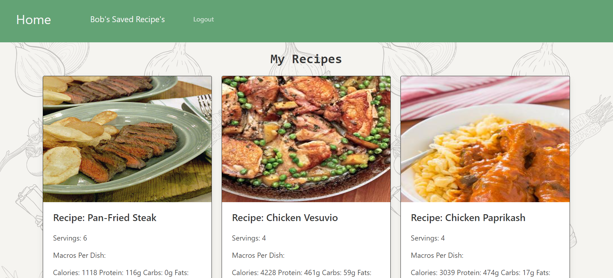

# Recipe Book - An Interactive MERN Application

## Our Task

Real-World problems need real-world solutions and as full-stack developers it is our goal to provide solutions that are efficient and advantageous for users. This is our first collaborative MERN-stack single-page application and we used some cutting edge and up to date technology to build a user-focused platform. Some of the tools we used were back end technologies like MongoDB, GraphQL API, Node.js, and Express.js and front end technologies like React, and a user authenticator called JWT (JSON Web Tokens). Our objective was to used incorporate agile method of work flow by using GitHub, managing the project with Kanban boards and WireFrames, and implementing GitFlow efficiencies like clean branches for each feature helping troubleshooting for bug fixes and pull requests. As a group we have utilized many great skills that we have learned throughout this course and aimed it at a real-world problem in order to not only demonstrate our problem-solving skills but also leverage our newly acquired knowledge to add a well polished portfolio piece. 

The following application embodies a multitude of features that meet the requirements that were put in place for this assignment. As you explore this application you will see a well polished UI on a site that was deployed onto Heroku with live data being served up by React components tested with GraphQL, MongoDB and seeded using Mongoose ODM database. This site is responsive and interactive with the intention of protecting sensitive information using API keys and web tokens for user sessions. You will also see a clean repository that meets quality coding standards like naming convention and file structure and of course this high-quality README to explain in detail what this project has materialized into.

## User Story

```md
AS food enthusiasts we want to provide a interactive way to view and create a list of recipes and
with healthy eating in mind we want easy access to delicious meals that are also clear about their nutritional value
So THAT meal planning and enjoying our favorite dishes can be a quick and easy process that saves a great deal of time each week

```

## Acceptance Criteria

```md
GIVEN a MERN-stack single-page application that runs off of an API
WHEN I view the page I see a Navbar, an area for search input, and a few buttons on a Homepage
THEN as I explore the Navbar I can that that there is an option to login and sign-up
WHEN I search for any meal or food title in the search input or by clicking the buttons without logging in
THEN I receive a return of 20 options that includes an image of the dish, the name of the dish, and a link to the recipe 
WHEN I click the link I am redirected to a site that hosts the recipe and instructions
THEN after I navigate back to the website
THEN I sign-up by filling out the username, email, and password
WHEN I created my account I am then logged in and redirected to the Homepage where I am greeted in the Navbar and see an option for Saved Recipes
WHEN I search for any meal or food title in the search input or by clicking the buttons while logged in
THEN I receive a return of 20 options that includes an image of the dish, the name of the dish, a save button, and a link to the recipe 
WHEN I click the link I am redirected to a site that host the recipe and instructions
WHEN I click on the save button
THEN my selection is added to my Saved Recipes page
WHEN I visit my Saved Recipes page I can see all of the dishes that I have saved with their nutritional value, name of meal, a link to their recipe, and a delete button that removes it from my list
THEN I click the link and I am redirected to a site that hosts the recipe and instructions
WHEN I navigate back to the website
THEN I click delete and the item is removed from my Saved Recipes list
WHEN I go up to the Navbar I click logout and my session is ended until I login again
```


## Review

This section is here to highlight the required elements needed for review:

* The following link will redirect you to our deployed link on Heroku:

Refer to this [Heroku Deployed URL](https://project-3-app-mck-b96b86dfcabe.herokuapp.com/) to view the functionality of this application
    

* The following link will redirect you to our GitHub repository, with a unique name and this README to describe the project:

Refer to this link [GitHub Repository](https://github.com/marinadelconte/Project-3) to view and explore the GitHub repo for this assignment

## Screenshots

The following images reflect the functionality and final results of development for this command-line application:

    






